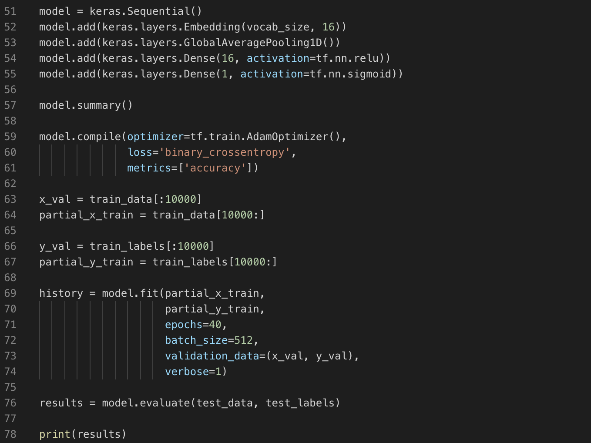

# Simple text classifier using TensorFlow

This notebook classifies movie reviews as positive or negative using the text of the review. This is an example of binary—or two-class—classification, an important and widely applicable kind of machine learning problem.

Full tutorial can be found [here](https://www.tensorflow.org/tutorials/keras/basic_text_classification)

 
